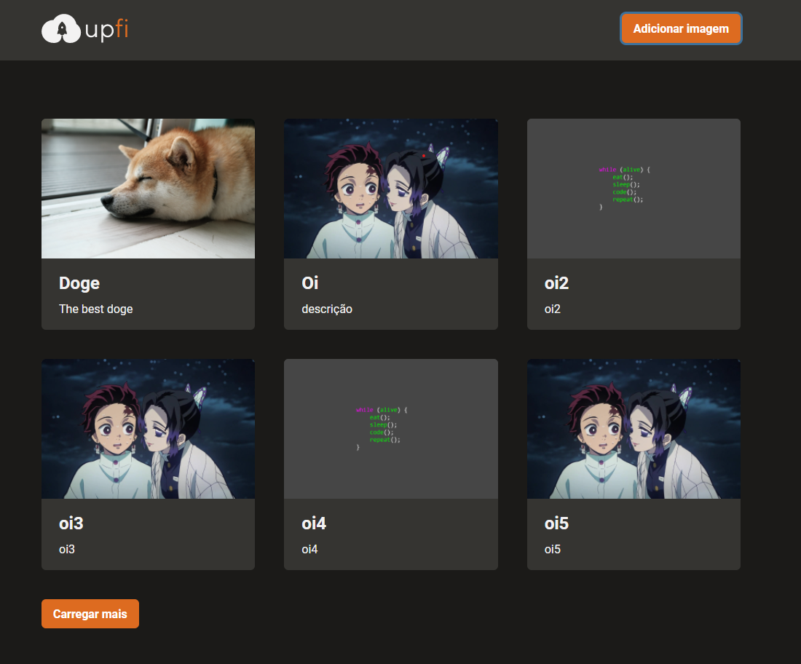
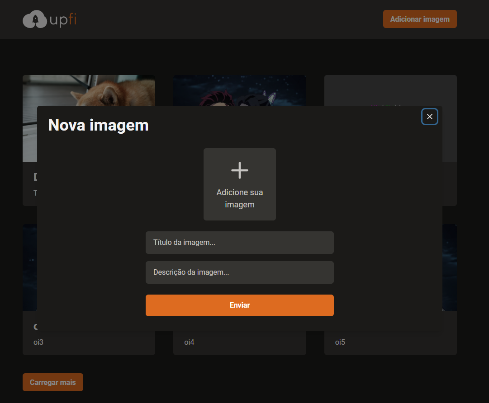

## About
  This was a challenge from bootcamp rocketseat where i did an app to upload images.
  When you got 7 images on the home page, will show a button to show more content

## Techs
 * [  ] Typescript
 * [  ] ReactJS
 * [  ] FaunaDB (database)
 * [  ] imgBB (to upload images)

## Demonstrations

